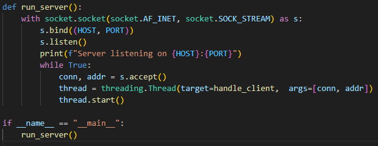
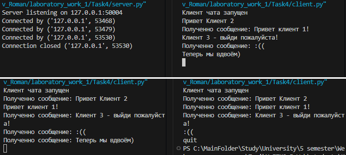

# Лабораторная работа 1. Вариант 1.

### Выполнил: Проскуряков Роман Владимирович K3339.

## Задание 1

Консоль приложения сервера

Консоль приложения клиента

Ничего особенного, просто "Hello world!" в сетевом мире.

## Задание 2

В нашем варианте требуется проводить вычисления по теореме Пифагора.

1. Вычислить гипотенузу по двум катетам

	

2. Вычислить катет по гипотенузе и другому катету

	

3. Можно разорвать соединение, и после этого приложение клиента завершается

	

Консоль сервера после предыдущих запросов

Сервер поддерживает паралельную обработку запросов за счёт разпределения клиентов по потокам.

## Задание 3

Запустим сервер на localhost:8080

html будем брать из лежашего рядом файла "index.html". Дальше оборачиваем его в HTTP сообщение и отправляем всем новым клиентам.

Наш сайт!

## Задание 4

Реализован многопользовательский чат. Если перед сообщением написано "Полученно сообщение:", то это сообщение было получено от другого клиента. Сообщения же без преписки были напечатаны самим клиентом и отправлены всем остальным. 

Комадной "quit" можно отсоединиться от чата и завершить программу.

Чат можно бесконечно дорабатывать - отправлять вместе с сообщением от кого оно, сохранять на сервере историю чата и отправлять её новым клиентам, отображать на клиентах список текущих пользователей в сети.

## Задание 5

Наш сайт!

После начальной реализации возникли две проблемы:

1. POST запрос делился на 2, в одном весь заголовок, во втором только тело запроса. 

	Я закостылил - если был POST запрос, но в нём не было контента, то следующий запрос воспринимать как этот контент (если конечно в нём нет заголовка). Вообще тут нужна буферизация, но я не стал с этим заморачиваться.

2. После отправки формы с сайта (POST запрос), на сайте не обновлялись данные в табличке + по f5 тот же POST запрос отправлялся второй раз.

	Всё правильно, ведь после обработки сервером запроса нужно сделать redirect на начальную страницу. Таким образом сейт пошлёт GET запрос и получит в ответ уже обновлённую страницу. После этого f5 будет посылать тот же GET запрос вместо POST.
	
	Таким образом в ответ на POST запрос сервер отправляет "HTTP/1.1 302 Found\r\nLocation: /\r\n\r\n", что и заставляет браузер совершить redirect на путь "/"